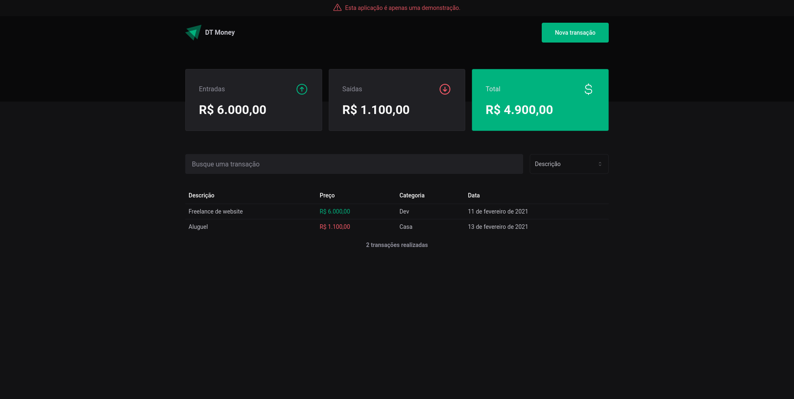

# DT-Money



## 🌟 Stacks

- [x] Next.js
- [x] Typescript
- [x] Tailwind CSS
- [x] Radix UI
- [x] SWR
- [x] Mirage JS

## 🔖 Layout
Você pode visualizar o layout do projeto através [desse link](https://www.figma.com/file/Bie67NBXEgU4I2pqZyg3vo/DT-Money-(Community)?type=design&node-id=0%3A1&mode=dev). É necessário ter conta no [Figma](http://figma.com/) para acessá-lo.

## 🔖 Como utilizar

Clone o repositório utilizando o código abaixo:

Utilizando a CLI do Github
```
gh repo clone rudneyrodrigues/dt-money
```

Utilizando o HTTPs
```
git clone https://github.com/rudneyrodrigues/dt-money.git
```

Utilizando o SSH
```
git clone git@github.com:rudneyrodrigues/dt-money.git
```

## Contate-me em:
[](https://www.linkedin.com/in/rudneyrodrigues/)
[](https://www.instagram.com/rudney.rodrigues.3/)
[](mailto:contato@rudneyrodrigues.dev.br)
